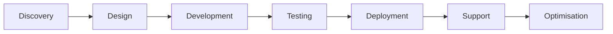

# 🚀 Edilander “Edi” Tôrres – Awesome Digital Freelancer

> **Transforming ideas into powerful digital solutions** 🌐✨

---

## 📋 Table of Contents

* [💡 About Me](#%EF%B8%8F-about-me)
* [🛠️ Services](#%EF%B8%8F-services)
* [🔧 Installation & Setup](#-installation--setup)
* [🚀 Projects & Portfolio](#-projects--portfolio)
* [📈 Workflow](#-workflow)
* [📫 Contact](#-contact)
* [📝 License](#-license)

---

## 💡 About Me

Hello! I’m **Edilander “Edi” Tôrres**, a digital freelancer based in **Braga, Portugal**, specialized in crafting bespoke web, e-commerce, apps, branding, SEO, photography, and IT support solutions. With over a decade of experience, I blend creativity and technology to deliver high-impact results.

* 🎓 **Background:** Web Development, Graphic & Multimedia Design, UX/UI, SEO, and IT Consulting.
* ⚙️ **Toolkit:** React, Next.js, WordPress, Figma, Adobe Suite, cPanel, Softaculous.
* 🌍 **Clients:** Freelancers, Entrepreneurs & SMEs across Portugal and beyond.

---

## 🛠️ Services

I offer a modular set of services that can be tailored to your specific needs:

| **Category**                       | **Highlights**                                                                                |
| ---------------------------------- | --------------------------------------------------------------------------------------------- |
| **Web & E-commerce & Apps**        | Responsive Sites, Landing Pages, Online Stores, Custom Apps (CMS, Portals), SEO-First         |
| **Visual & Multimedia**            | Branding, Logo Design, Print Collateral, UX/UI, Animations, Video & Interactive Presentations |
| **Photography & Image Processing** | Product & Corporate Shoots, Event Coverage, Retouching, Color Grading, Web-Optimized Assets   |
| **IT & Network Support**           | Local & Remote Support, System Builds, OS Installs, Malware Removal, Wi-Fi & Backup Solutions |
| **Consulting & Strategy**          | Digital Audits, SEO, Content Strategy, PPC Campaigns, KPI Definition, Workshops & Training    |

Each service can be expanded with a detailed [landing page](https://edilandertorres.pt) that dives deep into features, case studies, and client testimonials.

---

## 🔧 Installation & Setup

Want to launch a project with me? Here's how we get started:

1. **Reach Out:** Send a message on WhatsApp or email.
2. **Discovery Call:** Discuss goals, audience, and requirements.
3. **Proposal & Timeline:** Receive a personalized plan and schedule.
4. **Execution:** Development, design, testing and feedback loops.
5. **Launch & Support:** Go live, track performance, and optimise continuously.

---

## 🚀 Projects & Portfolio

A few highlights from my repertoire:

| Project        | Description                           | Link                                                   |
| -------------- | ------------------------------------- | ------------------------------------------------------ |
| Brand X E-Shop | Full-stack e-commerce platform        | [Demo](https://edilandertorres.pt/portfolio/brandx)    |
| Corporate Site | Responsive site with SEO optimisation | [View](https://edilandertorres.pt/portfolio/corporate) |
| Photo Gallery  | Interactive photo showcase            | [Explore](https://edilandertorres.pt/portfolio/photo)  |

Explore the full [Portfolio →](https://edilandertorres.pt/portfolio)

---

## 📈 Workflow

1. **Discovery:** Understand goals and user needs.
2. **Design:** Wireframes, prototypes, and visual mockups.
3. **Development:** Code implementation and integrations.
4. **Testing:** QA, accessibility, and performance checks.
5. **Deployment:** Go live with CI/CD pipelines.
6. **Support:** Continuous monitoring and improvements.

---

## 📫 Contact

| Method      | Details                                                                    |
| ----------- | -------------------------------------------------------------------------- |
| 🌐 Website  | [edilandertorres.pt](https://edilandertorres.pt)                           |
| 📞 WhatsApp | [+351 932 665 366](https://wa.me/351932665366)                             |
| ✉️ Email    |  [eu@editorres.pt](mailto:eu@editorres.pt)                                 |
| 🔗 LinkedIn | [linkedin.com/in/editorrespt](https://linkedin.com/in/editorrespt) |

Feel free to reach out for **collaborations**, **projects**, or just to say hi! 👋

---

> Made with ❤️ by **Edilander “Edi” Tôrres** – Crafting digital excellence.
